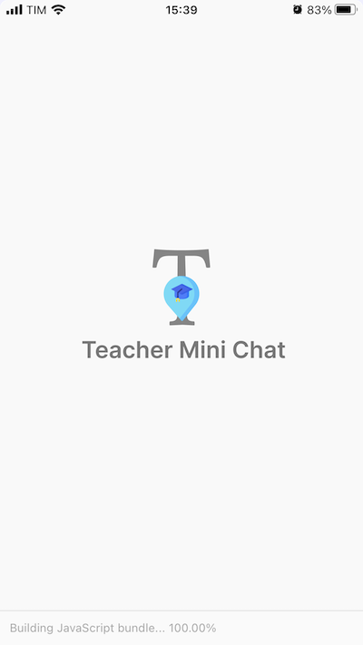
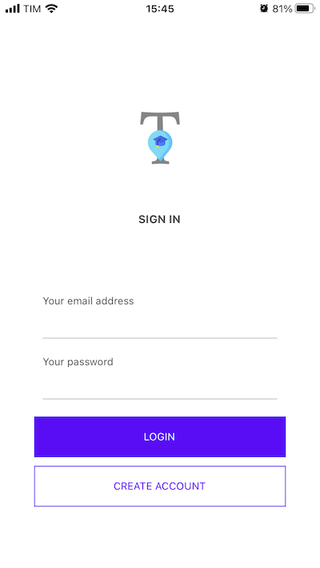
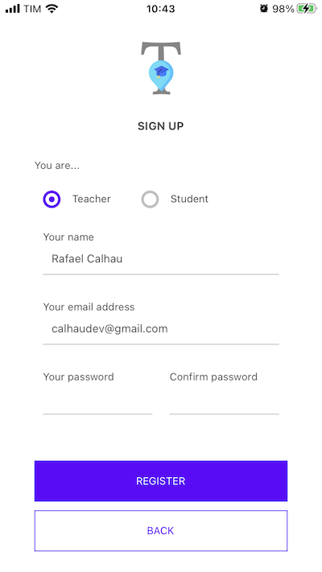
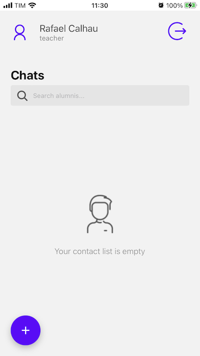
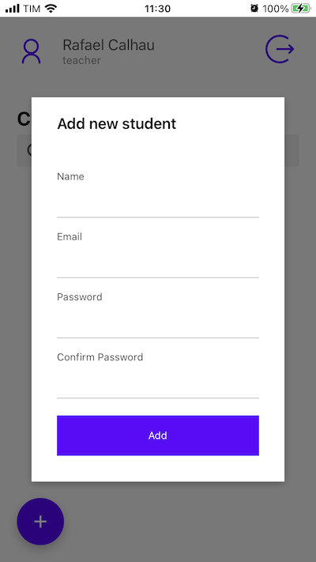
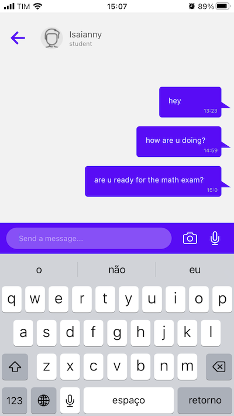
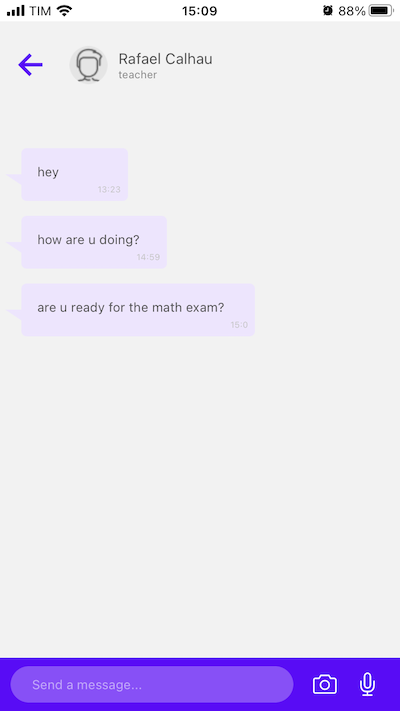
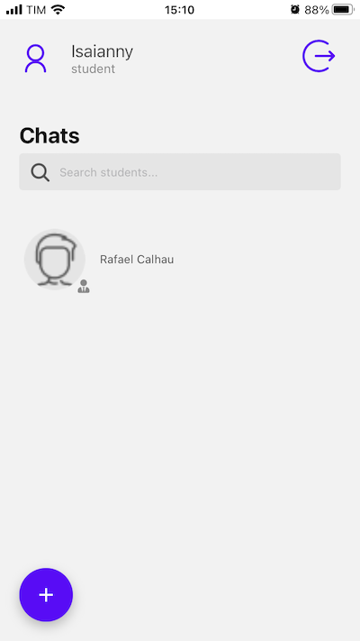
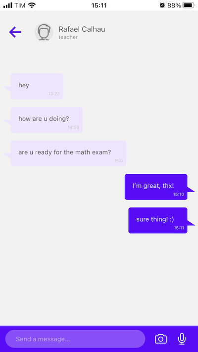

<div style="text-align: center; margin-bottom: 50px">
  <span style="font-size: 3em">💬</span>
  <div>
    <h1 style="margin-bottom: 5px; padding: 0 120px 5px; display: inline-block">Teacher Mini Chat</h1>
  </div>
  Just a simple and small real-time chat app built with React Native (Expo) and Firebase
</div>

## Get Started

1: Install the project dependencies:

```bash
$ npm install # yarn
```

2: Copy the .env.example to .env and update the values with your firebase credentials

```bash
$ cp .env.example .env
```

3: Run the project, you can visualize the app in your smartphone through the expo go:

```bash
$ npm start # yarn start
```

## Screenshoots










